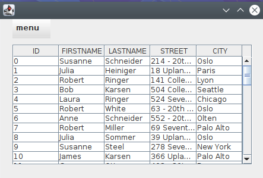
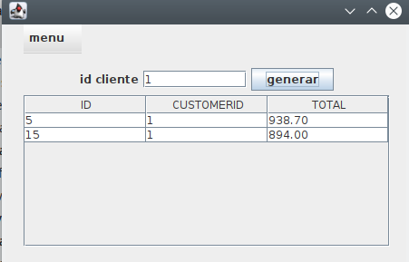
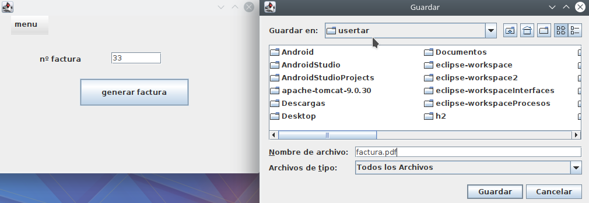
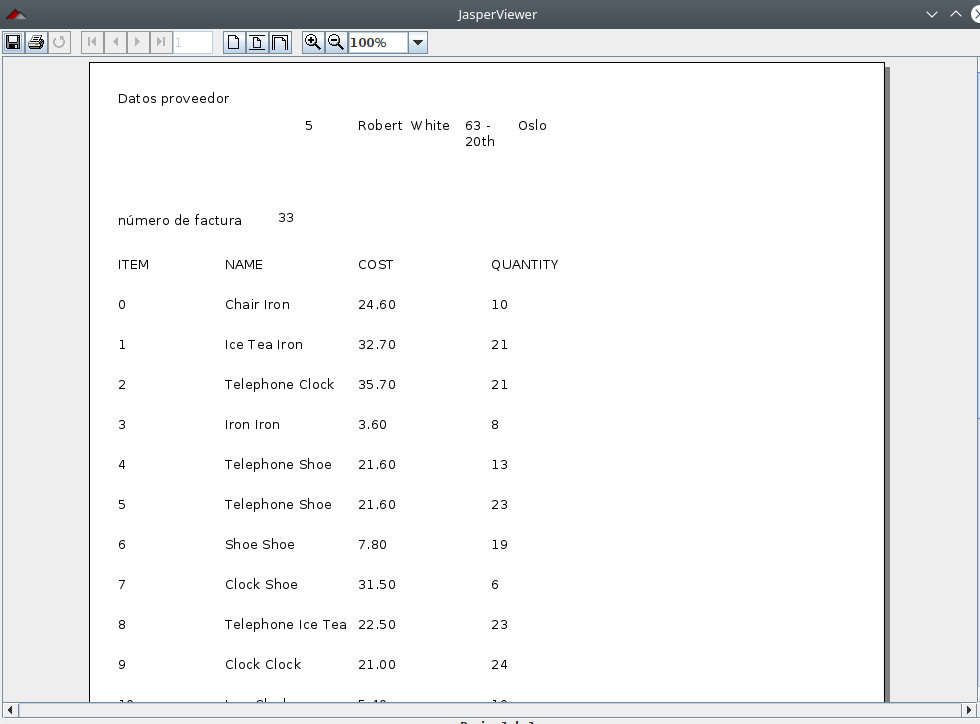

# Informes

<h2>Descripción </h2>
Esta es una aplicación que genera facturas enbase a un número de factura introducido. Los datos estarán conformados por tablas hsqldb a la que se conecta.

<h2>Librerías usadas en el proyecto </h2>

com.lowagie.text-2.1.7  
commons-beanutils-1.9.3  
commons-collections-3.2.1-1.0.0  
commons-collections4-4.1  
commons-digester-2.1  
commons-javaflow-1066591  
commons-logging-1.2  
hsqldb  
itext-2.1.7.js2  
jasperreports-6.11.0  

<h2>Funcionamiento de la interfaz</h2>

<h3>Primero se visualizan los clientes de la bbdd.</h3>

  
 <h3>Segundo se visualizan las facturas de los clientes de la bbdd.</h3>
 

 <h3>Tercero se introduce el número de factura que quieres imprimir o guardar.</h3>

 <h3>Resultado final</h3>

